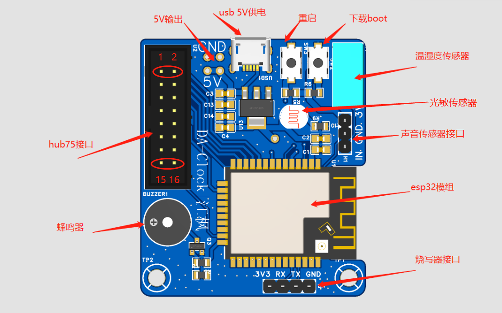

# ESP32-LED-Clock

基于 ESP32 的 Hub75 接口 LED 点阵屏时钟驱动板

> 本项目源自嘉立创开源广场：[基于esp32的led显示屏时钟](https://oshwhub.com/jiangfeng6533/led-ping-mu-shi-zhong)

---

## 📋 项目简介

本设计是一款 **Hub75 接口 LED 点阵屏驱动板**，基于 ESP32 模组开发，板载 5V 输入输出。支持驱动 **ICND2012、RUC7258、ICN2038S、SM5266P、ICN2037** 等芯片的 LED 屏幕。

目前市面上大量 LED 点阵屏采用 Hub75 接口，驱动此类屏幕通常需要占用 **13 个 IO 引脚**，本驱动板为此提供了简洁高效的解决方案。



---

## 🎯 应用场景

- 🕐 **公共场所室内时间显示器**
- 🎓 **LED 屏幕学习开发板**
- 🎵 **音乐频谱节奏显示器**

---

## ✨ 产品特性

- **开发友好**：使用 Arduino IDE 开发，库文件为 `ESP32_HUB75_LED_MATRIX_PANEL_DMA_Display`，支持图片、文字等多种样式
- **成本低廉**：外围元件少，稳定可靠
- **接口丰富**：板载温湿度传感器、光敏传感器、声音传感器
- **供电灵活**：预留并联 5V 接口，可直接与屏幕共用电源或为屏幕供电
- **功能多样**：固件支持 WiFi 自动同步时钟、音乐频谱模式、变色时钟模式、俄罗斯方块时钟模式
- **远程控制**：支持远程单独修改时间、温度、湿度、日期、农历、天气预报颜色，支持整点报时

---

## 📐 产品参数

| 参数 | 规格 |
|------|------|
| 输入电压 | DC 5V |
| 输出电压 | DC 5V |
| 屏幕通信接口 | Hub75 |
| WiFi 协议 | 2.4GHz |
| 传感器支持 | DHT11 温湿度传感器、声音传感器 |
| 功能按键 | 重启按键、下载按键 |
| 工作温度 | -40°C ~ +70°C |
| 工作湿度 | 40% ~ 80% RH |
| PCB 尺寸 | 4.38 × 5.02 cm |
| PCB 规格 | 双层板，顶层贴片 |

---

## 🛠️ 开发指南

1. 安装 [Arduino IDE](https://www.arduino.cc/en/software)
2. 安装 ESP32 开发板支持包
3. 安装 `ESP32_HUB75_LED_MATRIX_PANEL_DMA_Display` 库
4. 编写或上传固件至 ESP32 模组
5. 连接 Hub75 接口 LED 点阵屏，上电运行

---

## 📂 项目结构

```
ESP32-LED-Clock/
├── firmware/                    # 固件代码
│   └── ESP32_LED_Clock/         # Arduino 项目（多文件结构）
│       ├── ESP32_LED_Clock.ino  # 主程序（初始化、主循环、WiFi配网）
│       ├── WiFiConfig.ino       # WiFi 配置功能（SmartConfig、AP配网）
│       ├── TimeDisplay.ino      # 时间显示、农历、节日、老虎动画
│       ├── Weather.ino          # 天气获取（和风天气 API）与显示
│       ├── OLEDDriver.ino       # 显示驱动函数（位图、字符、数字）
│       ├── Sound.ino            # 蜂鸣器音乐（整点报时）
│       └── Config.ino           # 配置管理、NTP时间同步、传感器
├── images/                      # 图片资源
│   └── driver_board.png         # 驱动板实物图
├── pcb/                         # PCB 设计资料
│   ├── Netlist_Schematic1_2026-06-01.enet  # 原理图网表 (v1)
│   ├── Netlist_Schematic1_2026-06-02.enet  # 原理图网表 (v2, 最新)
│   ├── PCB_PCB1_2026-06-01.pdf             # PCB 图纸
│   └── SCH_Schematic1_2026-06-01.pdf       # 原理图
├── 开源广场附件/                 # 开源广场附件资料
│   ├── flash_package.zip        # 烧录包
│   ├── 效果图.jpg               # 效果图
│   └── LED时钟资料包/           # 完整资料包
│       ├── 下载烧录工具.rar
│       ├── 下载说明/            # 下载烧录说明截图
│       ├── 烧录固件/            # 预编译固件 (v6.2)
│       ├── PCB文件、电路图/     # 早期 PCB 设计文件
│       ├── 借鉴代码！！/        # 参考代码（含中文字库、WiFi、天气等）
│       ├── esp32开发板接线说明/  # 接线说明图
│      
└── README.md
```

---

## 🚀 快速开始

### 环境准备

1. 安装 [Arduino IDE](https://www.arduino.cc/en/software)
2. 在 Arduino IDE 中安装 ESP32 开发板支持包
3. 安装所需库：

   **① ESP32_HUB75_LED_MATRIX_PANEL_DMA_Display**（核心库，驱动 Hub75 接口 LED 屏幕）
   - 下载地址：[mrfaptastic/ESP32-HUB75-MatrixPanel-DMA](https://github.com/mrfaptastic/ESP32-HUB75-MatrixPanel-DMA)
   - 安装方式：下载 ZIP → Arduino IDE → **项目 → 加载库 → 添加 .ZIP 库**
   - 或通过库管理器搜索 `ESP32_HUB75_MATRIX_PANEL_DMA` 安装

   **② DHT sensor library**（温湿度传感器）
   - 通过库管理器搜索 `DHT sensor library` 安装

   **③ ArduinoJson**（JSON 解析，用于天气 API）
   - 通过库管理器搜索 `ArduinoJson` 安装

### 编译上传

源码采用 **多文件结构**（7 个 .ino 文件），Arduino IDE 在编译时会**自动合并**同一目录下的所有 .ino 文件，因此只需打开主文件即可：

1. 打开 `firmware/ESP32_LED_Clock/` 目录下的 **任意一个 .ino 文件**（推荐打开 `ESP32_LED_Clock.ino`）
2. Arduino IDE 会自动加载该目录下的所有 .ino 文件，在标签页中显示
3. 选择开发板为 `ESP32 Dev Module`
4. 点击 **上传** 按钮

> 💡 **提示**：Arduino IDE 会自动将 `ESP32_LED_Clock/` 目录下的所有 `.ino` 文件合并编译，无需手动添加每个文件。

> ⚠️ **刷机方式说明**：本驱动板的 Type-C 接口**仅用于供电**，不支持直接刷机。需要通过排针接口（H2）外接 USB 转串口工具（如 CH340G、CP2102）进行程序上传：
> - H2 排针：**TXD → USB 转串口的 RXD**，**RXD → USB 转串口的 TXD**，**GND → GND**

### 📶 WiFi 配置（首次使用）

固件支持 **Web 配网模式**，无需修改代码即可配置 WiFi：

1. **首次上电**：ESP32 会自动创建名为 `ESP32-LED-Clock` 的 WiFi 热点（密码：`12345678`）
2. **连接热点**：用手机或电脑连接该 WiFi
3. **打开配置页**：浏览器访问 `192.168.4.1`
4. **扫描并选择 WiFi**：点击"扫描 WiFi"按钮，从列表中选择你的 WiFi
5. **输入密码**：输入 WiFi 密码，点击"保存并连接"
6. **自动重启**：配置成功后设备会自动重启并连接你的 WiFi

> 💡 **重新配置**：如需更改 WiFi，按住开发板上的 **BOOT 按键** 重新上电即可再次进入配网模式

---

## 📄 许可证

本项目为开源硬件项目，遵循相关开源协议。欢迎 Fork 和贡献代码！

---

> 💡 **提示**：更多详细信息请访问原项目页面：[基于esp32的led显示屏时钟 - 立创开源硬件平台](https://oshwhub.com/jiangfeng6533/led-ping-mu-shi-zhong)
